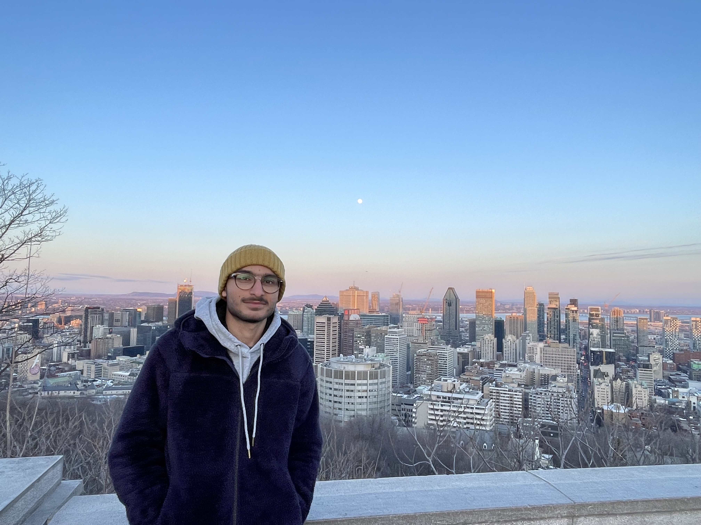

# **Hello, World!**

## Contents
- [Intro](#Introduction)
- [Favorite Quote](#my-favorite-quote-is)
- [Favorite Programming Languages](#my-top-3-favorite-programming-languages-are)
- [Tasks](#tasks)

## Introduction


My name is Georgio Feghali, and I'm a process-oriented computer engineering student, lifelong learner, and adventurer with a professional background in computer software engineering. Motivated by the opportunity that the tech industry provides to positively impact the life of an individual, and the world as a whole. I am currently a junior in Computer Engineering at the University of California, San Diego.


**More facts about me**
- Formula 1 nerd 🏎
- Enthusiastic about anything in the engineering world ⚙️👨🏾‍💻
- I like to build my own software.

**Connect with me 🔗**

<a href="https://twitter.com/fe_ghali" target="blank"></a>
<a href="https://www.linkedin.com/in/georgio-feghali/" target="blank"></a>
<a href="https://www.instagram.com/georgiofe/" target="blank"></a>
<a>&nbsp;</a>
<a href="mailto:giorgiofeghali2002@icloud.com" target="blank"></a>

---

## My favorite Quote is:
>*“The whole future lies in uncertainty: live immediately.” - Seneca*

---

## My top 3 favorite programming languages are:
1. `C++`.
2. `Python`.
3. `Julia`.
```
#include <iostream>
using namespace std;

int main () {
    cout << "Hello, World!" << endl;

    return 0;
}
```

---
[Click Here to see the LinkTree I made.](https://aquamarine-salamander-975f59.netlify.app/)

---

[Relative Link to test.md](test.md)

---
## Tasks
Tasks for this week:
- [x] Slack Setup.
- [x] Message to Prof.
- [x] Lab 1.


